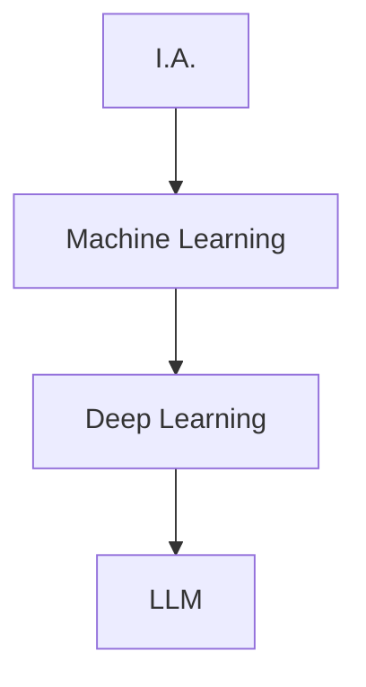

# I.A. Full Cycle com TypeScript

Isso mesmo: tipos, *console.log()* e código com chaves!

TDC POA — 2024

---

##### Quem sou eu

**Laion Azeredo**

webdev 12 yrs+

lead dev @ ADP

   

  <strong>
    !(Especialista em  I.A.)
  </strong>

---

##### Agenda

- Glossário
- Porque Python domina o campo de I.A.
- O *landscape* de linguagens para I.A.
- JS/TS e I.A.: O Ecossistema atual
- *Talk is cheap, show me the code!*
  - Data Science com Jupyter, Deno e Danfo.js
  - Machine Learning com TensorFlow.js
  - Webapp com Deno Fresh e TensorFlow.js
  - Deploy com Deno Deploy

---

##### Glossário (1)

**I.A.: Inteligência Artificial**

- um dos campos pioneiros da ciência da computação;
- trata de estudos e práticas que possibilitam a criação de sistemas que simulem a inteligência humana;
- ***exemplos**: reconhecimento de voz, visão computacional, processamento de linguagem natural, etc.*

---

##### Glossário (2)

**Machine Learning**

- campo de estudo mais restrito, dentro do guarda-chuva da I.A.;
- trata de estudos e práticas que possibilitam a criação de sistemas que aprendem com dados;
- ***exemplos**: classificação de imagens, previsão de séries temporais, etc.*

---

##### Glossário (3)

**Deep Learning**

- subcampo do Machine Learning;
- trata de estudos e práticas que possibilitam a criação de sistemas que aprendem com dados, mas com redes neurais profundas;
- ***exemplos**: reconhecimento de imagens, tradução automática, etc.*

---

##### Glossário (4)

**LLM — Large Language Models**

- subcampo do Deep Learning;
- são modelos de redes neurais que aprendem com grandes quantidades de texto;
- ***exemplos**: GPT-4, Gemini, Llama, etc.*

---

##### Glossário (5)

