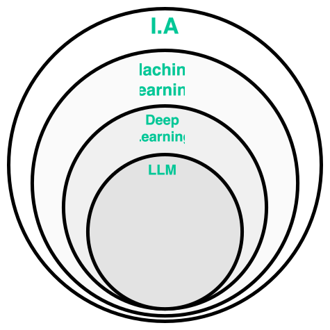
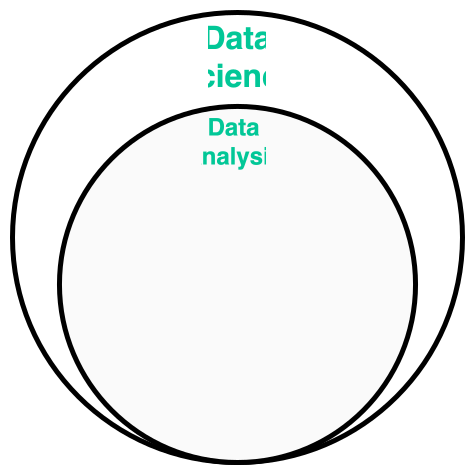

# I.A. Full Cycle com TypeScript

Isso mesmo: tipos, *console.log()* e código com chaves!

TDC POA — 2024

---

##### Quem sou eu

**Laion Azeredo**

webdev 12 yrs+

lead dev @ ADP

   

  <strong>
    !(Especialista em  I.A.)
  </strong>

---

##### Agenda

- Glossário
- Porque Python domina o campo de I.A.
- O *landscape* de ecossistemas para I.A.
- JS/TS e I.A.: O Ecossistema atual
- *Talk is cheap, show me the code!*
  - Data Science com Jupyter, Deno e Danfo.js
  - Machine Learning com TensorFlow.js
  - Webapp com Deno Fresh e TensorFlow.js
  - Deploy com Deno Deploy

---

##### Glossário (1)

**I.A.: Inteligência Artificial**

- um dos campos pioneiros da ciência da computação;
- trata de estudos e práticas que possibilitam a criação de sistemas que simulem a inteligência humana;
- É um campo bastante abrangente e multidisciplinar;
- ***exemplos**: reconhecimento de voz, visão computacional, processamento de linguagem natural, modelos preditivos e classificatórios em geral, etc.*

---

##### Glossário (2)

**Machine Learning**

- campo de estudo mais restrito, no guarda-chuva da I.A.;
- trata de estudos e práticas que possibilitam a criação de sistemas que aprendem com dados;
- são ideais para a criação de modelos classificatórios e preditivos para a maioria dos fenômenos;
- ***exemplos**: classificação de imagens, previsão de séries temporais, etc.*

---

##### Glossário (3)

**Deep Learning**

- subcampo do Machine Learning;
- trata de estudos e práticas que possibilitam a criação de sistemas que aprendem com dados, mas com redes neurais profundas;
- são ideais para atividades de aprendizado complexas como reconhecimento de imagem;
- ***exemplos**: reconhecimento de imagens, tradução automática, etc.*

---

##### Glossário (4)

**LLM — Large Language Models**

- subcampo do Deep Learning;
- são modelos de redes neurais que aprendem com grandes quantidades de texto;
- tem ganhado popularidade por permitir uma ‘interface’ amigável para humanos interagirem com esta classe de modelos;
- ***exemplos**: GPT-4, Gemini, Llama, etc.*

---

##### Relação entre os campos

---

##### Glossário (5)

**Data Science**

- campo de estudo que trata da análise de dados para modelar relações entre eles;
- utiliza técnicas de estatística, matemática e programação para extrair informações de dados;
- tenta criar modelos preditivos ou descritivos a partir dos dados;
- **atividades comuns**: modelagem estatística, *machine learning*, visualização de dados, etc.*;

___

##### Glossário (6)

**Data Analysis**

- subcampo do Data Science;
- trata da limpeza, organização e análise exploratória de dados;
- não se preocupa tanto com predições sobre a evolução dos fenômenos estudados;
- **atividades comuns**: coleta, limpeza, análise, visualização e interpretação de dados;

---

##### Relação entre os campos

---
##### IA Full Cycle

<a style='font-size: 14px;' href='https://www.datacamp.com/blog/machine-learning-lifecycle-explained'>Fonte: DataCamp</a>

---
##### IA Full Cycle - Stack

---

##### IA Full Cycle - Complexidade

---

### Programming Should be Simple!
Ryan Dahl (2024)

___

##### Python e IA

 - E talvez essa frase explique, em partes, porque [Python é o ecossistema mais popular para IA e *machine learning*](https://www.sitepoint.com/best-programming-language-for-ai/);
 - A evolução das bibliotecas do Python para a área científica nos aponta um caminho para explicar essa popularidade;

---

##### Uma breve história de Python ♥️ IA (1)

- Python surge em 1991 como um ['projeto de natal' de Guido Van Rossum](https://pt.wikipedia.org/wiki/Guido_van_Rossum#:~:text=H%C3%A1%20mais%20de,%5B6%5D);
- A ideia era criar uma linguagem ['tão fácil de ler quanto o inglês'](https://pt.wikipedia.org/wiki/Guido_van_Rossum#:~:text=c%C3%B3digo%20que%20fosse%20t%C3%A3o%20intelig%C3%ADvel%20quanto%20ingl%C3%AAs) e que fosse de uso prático para tarefas simples do dia a dia;

---

##### Uma breve história de Python ♥️ IA (2)

- Principalmente após a publicação do Python 2.0, a linguagem começa a se tornar bastante popular entre a comunidade Linux, principalmente para a programação de utilitrários;
- Mas a principal *virada de chave* para a adoção do Python no ramo científico foi o lançamento do [**Numpy**](https://numpy.org/) em 2005;

---

##### Uma breve história de Python ♥️ IA (3)

- O Numpy traz para o jogo estruturas de dados novas para lidar de modo eficiênte com arrays multidimensionais e operações matemáticas complexas;
- Com um *backend* em **C** (para a maioria das operações com arrays) e **Fortran** (para a parte de Algebra Linear, em especial), a performance do Numpy associada com a simplicidade do Python fizeram o ecossistema crescer exponencialmente na comunidade científica;

---

##### Uma breve história de Python ♥️ IA (4)

  Na esteira do Numpy e do crescimento do Python para fora da comunidade *hacker* do Linux, vieram ao mundo diversas bibliotecas que compõem a base do ecossistema e sua força atual;

---

##### Uma breve história de Python ♥️ IA (5)

- Ainda em 2005, o **SciPy** consolida sua infraestrutura em torno do Numpy;
- Em 2007 temos o lançamento do **scikit-learn**, trazendo diversos algorítmos de *machine learning* com uma interface amigável e eficiênte;
- Em 2008 chega o **Pandas** e seu *Dataframe* para lidar com dados tabulares;
- Entre 2015 e 2016 temos **TensorFlow** e **PyTorch** que trazem *deep learning* de modo acessível para a comunidade;

---

##### Principais Features

- baixo custo de entrada...

---

##### E o ecosssitema JS/TS?

___

##### Diferenciais do ecossistema JS/TS

---

##### Uma stack possível

---

##### Ecossistema JS/TS atual

---

##### Desafios

---

#### Vamos para a prática?

---

##### Next slides

- o ciclo de desenvolvimento de IA passa por data analysis, data science, machine learning ou deep learning
- mas nao apenas isso, pois envolve tambem a parte de engenharia de software, como deploy, monitoramento, etc.
- e a parte de infraestrutura, como cloud, containers, etc.
- Um modelo que nao é entregue como produto de pouco adianta
- Python domina o mercado de I.A. por ser uma linguagem de alto nível, com muitas bibliotecas e frameworks. O ecossistema ganha
- Voce tem diversas opcoes de linguagens para I.A., como R, Julia, Mojo, Rust, Go, etc.
- Mas na hora de entregar esses modelos pela web, voce ainda depende de JS/TS, tornando sua stack mais complexa.
- Recentemente, o ecossistema de JS/TS para I.A. tem crescido, com bibliotecas como TensorFlow.js, Danfo.js, etc.
- O que facilira a lógica de fullstack e fullcycle de I.A. com JS/TS
- Vamos ver como isso funciona na prática
